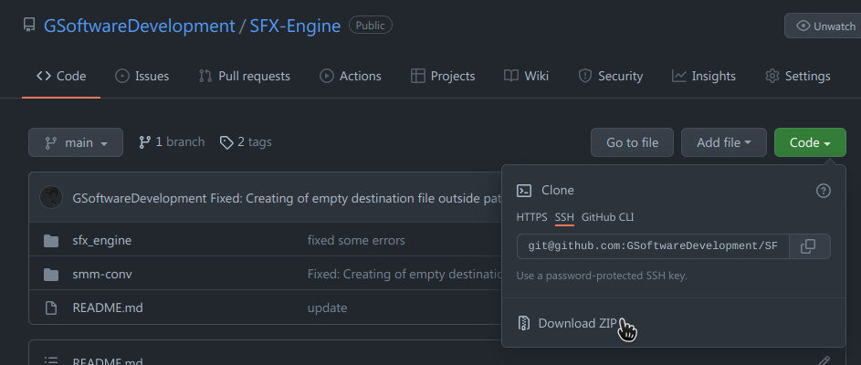

# Jak skorzystać z SFX-Engine w MAD Pascalu

* Wejdź na stronę repozytorium [SFX-Engine](https://github.com/GSoftwareDevelopment/SFX-Engine) i ściągnik plik ZIP, klikając w przycisk **CODE** (jak na poniższym obrazku)

  

- Paczkę rozpakuj gdzieś na swoim dysku

- Katalog `sfx_engine` należy skopiować do katalogu swojego projektu.

  Przykładowa struktura katalogu projektu, może wyglądać tak:

~~~txt
+ /Projekt
|
+- /sfx_engine
|  |  sfx_engine.conf.inc
|
+- /music
|  | {pliki wygenerowane przez smm-conv}
|
+-- main.pas
|   
~~~

- w głównym pliku swojego programu `main.pas` zadeklaruj ścieżkę dostępu do biblioteki `sfx_engine` i `music` oraz utwórz deklarację biblioteki w sekcji `uses`, np.

~~~pascal
{$librarypath './sfx_engine/'}
{$librarypath './music/'}

uses SFX_API, atari;
~~~

- plik `sfx_engine.conf.inc` należy dostosować do własnych potrzeb lub skasować :smile:

## Wykorzystanie programu `smm-conv`

Przed użyciem, należy skompilować program, ale z racji świąt, mam dla Was mały prezent. 

[Skompilowana wersja 1.0.1 dla Windows](https://github.com/GSoftwareDevelopment/SFX-Engine/releases/download/smm-conv1.0.1/smm-conv.exe)

* Skopiuj ściągnięty plik do katalogu `/music` 

Załóżmy, że nasz plik z muzyką nazywa się `music.smm` i jest on umieszczony w katalogu `/music` projektu.

* Uruchom `cmd.exe` i przejdź do katalogu projektu

  ~~~
  cd /music
  ~~~

* W linii komend wpisz:

~~~bash
smm-conv music.smm music.asm -reduce:all -reindex:all -MC -MR -Ao:0x7000 -Aa:0
~~~

Znaczenie parametrów:

- `music.smm` - nazwa pliku źródłowego (nasza muzyczka)
- `music.asm` - nazwa pliku wyjściowego - dane w assemblerze
- `-reduce:all` - wyłącza z pliku wyjściowego nieużywane definicje SFXów oraz TABów (opcja `all`)
- `-reindex:all` - układa kolejno indeksy definicji SFXów oraz TABów

Powyższe dwie opcje redukują rozmiar pliku wynikowego oraz zapotrzebowanie na pamięć w **ATARI**.

- `-MC` - generuje plik konfiguracyjny dla **SFX_API** `sfx_engine.conf.inc`
- `-MR` - generuje plik z definicją zasobów dla **MAD Pascala** `resource.rc`
- `-Ao:0x7000` - określa adres (tzw. globalny) dla generowanyh danych w assemblerze
- `-Aa:0` - powoduje wyłączenie buforowania audio (rejestrów **POKEY**) w pliku konfiguracyjnym `sfx_engine.conf.inc`

Po więcej szczegółów nt. konwertera odsyłam do pliku [README.md programu  **SMM-CONV**](https://github.com/GSoftwareDevelopment/SFX-Engine/blob/smm-conv1.0.1/smm-conv/README.md).

Uruchomienie powyższej komendy, spowoduje wygenerowanie następujących plików w katalogu `/music`

~~~ascii
+- /music
   | music.asm
   | resource.rc
   } sfx_engine.conf.inc
~~~

**WAŻNE** Należy dodać ścieżkę w wygenerowanym pliku `music/resource.rc`, gdyż kompilator MAD Pascal **odwołuje się względem położenia pliku głównego `main.pas`**, nie zaś położenia pliku zasobu który jest dodany do programu.

~~~pascal
SFX_ORG rcasm 'music/music.asm';
~~~

W pliku głównym projektu dodać należy jeszcze wczytanie pliku zasobu muzyki. 

~~~pascal
{$librarypath './sfx_engine/'}
{$librarypath './music/'}

uses SFX_API, atari;

{$r "music/resource.rc"}
~~~

**UWAGA!** W przypadku rozdzielenia danych za pomocą przełącznika `-Ad:` (w konwerterze `smm-conv`) należy, wczytanie pliku zasobu `{$r "music/resource.rc"}`  umieścić <u>na samym początku programu</u>, przed wywołaniem innych zasobów.

* W programie głównym `main.pas` dodaj jeszcze następujące linie:

~~~pascal
Begin
	SFX_StartVBL();
	SFX_PlaySong(0);
	repeat until ch<>255; ch:=255;
	SFX_End();
End.
~~~

* `SFX_StartVBL` inicjuje silnik SFX, podpinając go pod przerwanie VBLANK.
* `SFX_PlaySong(0)` uruchamia odtwarzanie muzyczki od wiersza 0.

* `SFX_End()` kończy działanie silnika SFX

* Skompiluj plik `main.pas` - jak to zrobić najwygodniej? Odsyłam do dokumentu @Bocianu [MAD Pascal i Geany](http://bocianu.atari.pl/blog/madgeany)

* Uruchom XEXa

  

I to tyle - można się cieszyć muzyką z programu **SFX Music Maker** (aka **SFX-Tracker**) w swoim projekcie :)
